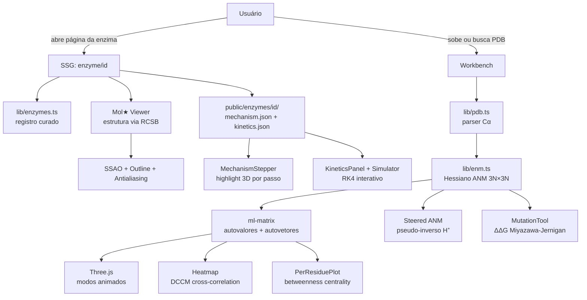
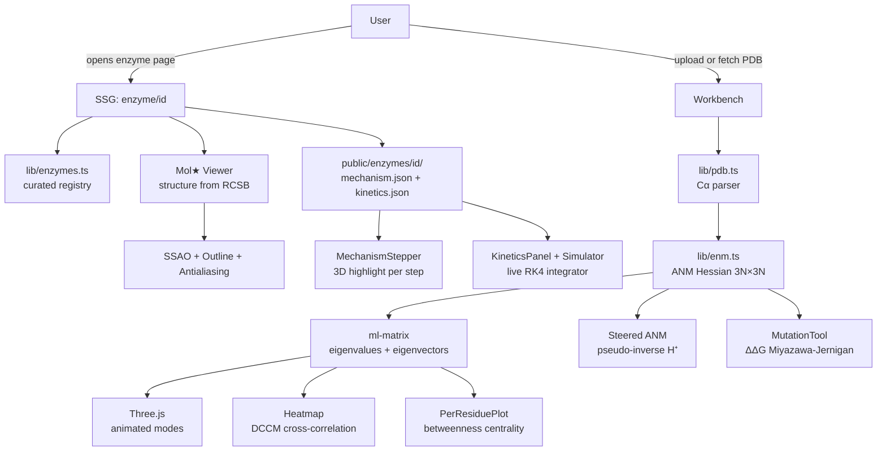

<div align="center">
  

  <h1>Catalytic Atlas</h1>

  <p><strong>Explore enzymes deeply — structure, mechanism, kinetics, dynamics. All in the browser. No server, no account, no limits.</strong></p>
  <p><em>Explore enzimas em profundidade — estrutura, mecanismo, cinética e dinâmica. Tudo no navegador. Sem servidor, sem conta, sem limites.</em></p>

  <br/>

  [](https://catalytic-atlas.vercel.app)

  <br/>

  
  
  
  
  
  
  [](https://github.com/caioross/CatalyticAtlasEDE/actions)
  
  

  <br/>

  🇧🇷 [**Português**](#-português) · 🇺🇸 [**English**](#-english)

</div>

---

## 🇧🇷 Português

### O que é

**Catalytic Atlas** é um explorador aberto de enzimas, *browser-native*, que coloca numa única aba o que normalmente exige cluster, *force field* e especialista.

Cada enzima do catálogo tem:

- **Estrutura 3D fiel** — renderizada com Mol\* (o mesmo motor do RCSB, PDBe e EMDB), com SSAO, delineamento e antialiasing.
- **Mecanismo curado passo a passo** — resíduos catalíticos, estados de transição e etapa limitante, extraídos do M-CSA e da literatura primária.
- **Cinética do registro** — kcat, KM, kcat/KM, pH, temperatura e fonte para cada entrada, com um simulador RK4 interativo.
- **Dinâmica calculada no navegador** — o **Anisotropic Network Model (ANM)** constrói o Hessiano, decompõe os autovalores e exibe os modos lentos animados em 3D — tudo com `ml-matrix`, sem servidor.

> Nenhum dado sai do seu navegador. Cada URL é um *deep-link* reprodutível.

---

### Por que ANM e não MD?

| | ANM (este projeto) | Dinâmica Molecular |
|---|---|---|
| **Configuração** | Zero — direto no navegador | Cluster, force field, parameterização |
| **Tempo de execução** | < 1 s para ≤ 1200 resíduos | Horas a dias |
| **Determinismo** | ✅ Completamente | Depende de sementes/ensemble |
| **O que captura** | Modos lentos e coletivos, B-factors, alosteria | Tudo — solvatação, reatividade, ms-µs |
| **Melhor para** | Exploração interativa, hipóteses, ensino | Produção científica, precisão quantitativa |

---

### Funcionalidades

<table>
<tr>
<td width="50%">

**Visualizador 3D (Mol\*)**
- Representações: cartoon, superfície vdW, ribbons, sticks
- Esquemas de cor: cadeia, estrutura secundária, hidrofobicidade
- Destaque de resíduos catalíticos por passo do mecanismo
- Inspetor de resíduo ao clicar
- Screenshot em alta resolução

</td>
<td width="50%">

**Mecanismo Catalítico**
- *Stepper* animado pelo ciclo catalítico
- Highlight 3D dos resíduos ativos por etapa
- Setas de transferência de prótons/elétrons
- Referências primárias por passo (M-CSA, literatura)

</td>
</tr>
<tr>
<td>

**Simulador Cinético**
- Parâmetros curados: kcat, KM, kcat/KM
- Integrador RK4 de Michaelis-Menten em tempo real
- Ajuste interativo de [S], inibição competitiva/não-competitiva
- Tabela de parâmetros por substrato, pH e temperatura

</td>
<td>

**Workbench de Dinâmica (ANM)**
- Upload de qualquer PDB ou busca por ID (RCSB)
- Modos normais animados com coloração por amplitude
- Matriz DCCM (correlação cruzada dinâmica)
- *Betweenness centrality* → hubs alostéricos
- ANM dirigido (*steered*): resposta a perturbações
- Ferramenta de mutação: ΔΔG (Miyazawa-Jernigan)
- *Pathway finder*: menor caminho de propagação mecânica

</td>
</tr>
</table>

---

### Catálogo de Enzimas

| Enzima | EC | PDB | Organismo | Destaque |
|--------|-----|-----|-----------|----------|
| **Lisozima** | 3.2.1.17 | [1AKI](https://www.rcsb.org/structure/1AKI) | *Gallus gallus* | Arquétipo glicosidase, mecanismo de retenção (oxocarbenium) |
| **Triose-fosfato isomerase** | 5.3.1.1 | [1YPI](https://www.rcsb.org/structure/1YPI) | *S. cerevisiae* | Enzima "perfeita" — limitada por difusão, barril TIM |
| **α-Quimotripsina** | 3.4.21.1 | [4CHA](https://www.rcsb.org/structure/4CHA) | *Bos taurus* | Tríade catalítica Ser–His–Asp, *oxyanion hole*, serina protease |
| **Anidrase Carbônica II** | 4.2.1.1 | [3KS3](https://www.rcsb.org/structure/3KS3) | *Homo sapiens* | Mais rápida conhecida (~10⁶ s⁻¹), "fio de prótons", Zn²⁺ |
| **Protease do HIV-1** | 3.4.23.16 | [1HVR](https://www.rcsb.org/structure/1HVR) | *HIV-1* | Díade Asp simétrica, flaps alostéricos, alvo de antiretrovirais |
| **SARS-CoV-2 Mpro** | 3.4.22.69 | [6LU7](https://www.rcsb.org/structure/6LU7) | *SARS-CoV-2* | Cisteína–histidina, dímero funcional, alvo do Paxlovid |

---

### Como rodar

**Pré-requisitos:** Node.js ≥ 18, npm ≥ 9

```bash
# 1. Clone e instale
git clone https://github.com/caioross/CatalyticAtlasEDE.git
cd CatalyticAtlasEDE
npm install

# 2. Inicie o servidor de desenvolvimento
npm run dev
# → http://localhost:3000
```

```bash
# Build de produção
npm run build && npm run start

# Verificações de qualidade
npm run typecheck   # TypeScript strict, sem emitir
npm run lint        # ESLint (next lint)
```

**Adicionar nova enzima:**

```bash
npm run ingest -- 1RX2 --slug dhfr-1rx2
```

O script busca metadados no RCSB, a entrada UniProt e o mecanismo no M-CSA (por número EC), gerando *scaffolds* em `public/enzymes/<slug>/`. Depois registre em `lib/enzymes.ts` e complete a curadoria (≈1–2 h por enzima lendo M-CSA e a literatura primária).

---

### Estrutura do Projeto

```
app/
  layout.tsx · page.tsx        # Layout raiz + home/catálogo
  enzyme/[id]/page.tsx         # SSG por enzima (carrega JSON de /public)
  workbench/page.tsx           # Workbench ANM client-side
  about/page.tsx               # Escopo, fontes, limites
  sitemap.ts · robots.ts       # SEO automático

components/
  SiteLayout.tsx               # Header (sticky) + Footer
  EnzymeDetailView.tsx         # View principal: estrutura + mecanismo + cinética
  EnzymeCard.tsx               # Card do catálogo
  MechanismStepper.tsx         # Navegador de passos catalíticos
  KineticsPanel.tsx            # Tabela de parâmetros cinéticos
  KineticSimulator.tsx         # Simulador RK4 interativo
  ENMAnalysis.tsx              # Workbench principal (upload/análise)
  ModeViewer.tsx               # Visualizador de modos normais
  SteeredANMPanel.tsx          # Resposta ANM dirigida
  PathwayFinder.tsx            # Finder de caminhos alostéricos
  Heatmap.tsx                  # Matriz DCCM
  viewer/
    MolstarViewer.tsx          # Mol* encapsulado
    ThreeViewer.tsx            # Renderizador Three.js customizado
    ThreeModeViewer.tsx        # Animador de modos Three.js
    MutationTool.tsx           # Sandbox de mutação (ΔΔG Miyazawa-Jernigan)
    ResidueInspector.tsx       # Inspetor de resíduo ao clicar
    ViewerControls.tsx         # Controles (repr, cor, spin, screenshot)

lib/
  enzymes.ts                   # Registro curado das enzimas
  pdb.ts                       # Parser PDB mínimo (apenas Cα)
  enm.ts                       # Hessiano ANM + autodecomposição + BC + steered
  mutations.ts                 # Potencial Miyazawa-Jernigan
  types.ts · utils.ts

public/enzymes/<id>/
  mechanism.json               # Passos mecanísticos + resíduos + referências
  kinetics.json                # Parâmetros cinéticos curados

scripts/
  ingest.mjs                   # Scaffold de novas entradas (RCSB/UniProt/M-CSA)
```

---

### Arquitetura



---

### Notas de Método

| Método | Implementação | Referência |
|--------|--------------|-----------|
| **Hessiano ANM** | Molas Hookeanas entre Cα dentro do *cutoff* (padrão 13 Å), γ = 1.0 | Atilgan et al., *Biophys J* 2001 |
| **Coletividade** | Entropia normalizada de amplitude por modo | Brüschweiler, *JCP* 1995 |
| **DCCM** | Cij = ⟨ΔriΔrj⟩ / √⟨Δri²⟩⟨Δrj²⟩, somada sobre modos positivos | Ichiye & Karplus, *Proteins* 1991 |
| **Betweenness Centrality** | Dijkstra em grafo de contatos ponderado por \|Cij\|⁻¹ | Brandes, *JMMA* 2001 |
| **Steered ANM** | Deslocamento linear via pseudo-inverso da Hessiana | Atilgan & Atilgan, 2009 |
| **ΔΔG mutação** | Potencial de contato Miyazawa-Jernigan + volume + carga + burial | Miyazawa & Jernigan, *Macromolecules* 1985 |

---

### Limites

- ANM de conformação única — não descreve transições nem *unfolding*
- Sem solvente explícito (o *proton wire* da anidrase carbônica é anotado, não simulado)
- Sem química reativa (puramente harmônico)
- Limite prático ≈ 1.200 resíduos (autodecomposição O(N³))
- ΔΔG é heurístico, não termodinâmico — use para hipóteses, não para decidir

---

### Contribuindo

Contribuições são bem-vindas! As formas mais valiosas:

1. **Curar uma nova enzima** — o script `ingest.mjs` gera o *scaffold*, e a curadoria real (mecanismo, cinética, resíduos) é o trabalho de valor.
2. **Reportar erros científicos** — se um passo do mecanismo ou parâmetro cinético estiver errado, abra uma *issue* com a referência correta.
3. **Melhorias de UI/DX** — *pull requests* são revisados.

```bash
# Fork → branch → PR
git checkout -b feat/nova-enzima
npm run dev
# ... edite, teste ...
git push origin feat/nova-enzima
```

**Prioridades no roadmap:**
- Expandir para 20–50 enzimas cobrindo todas as 7 classes EC
- Trajetórias MD pré-computadas (mdCATH / BioExcel) como ensembles comprimidos
- Detecção de *pocket* no workbench
- Perfis QM/MM como diagramas de energia interativos

---

### Fontes de Dados

| Fonte | Licença | Uso |
|-------|---------|-----|
| [RCSB PDB](https://www.rcsb.org) | Domínio público | Estruturas 3D |
| [UniProt](https://www.uniprot.org) | CC-BY 4.0 | Anotação funcional |
| [M-CSA](https://www.ebi.ac.uk/thornton-srv/m-csa/) | CC-BY 4.0 | Mecanismos e resíduos catalíticos |
| [SABIO-RK](https://sabiork.h-its.org) | CC-BY | Parâmetros cinéticos |
| [BRENDA](https://www.brenda-enzymes.org) | Academic | Referência adicional |

---

### Licença

**Código:** MIT — use, modifique, distribua livremente.

**Dados curados** (`public/enzymes/`): **CC-BY 4.0** — atribua ao Catalytic Atlas e às fontes originais (RCSB, UniProt, M-CSA, SABIO-RK).

---

## 🇺🇸 English

### What it is

**Catalytic Atlas** is an open, browser-native enzyme explorer that puts into a single tab what normally requires a cluster, a force field, and a specialist.

Every enzyme in the catalogue includes:

- **Photo-real 3D structure** — rendered with Mol\* (the same engine used by RCSB, PDBe and EMDB), complete with screen-space ambient occlusion, an outline pass, and antialiasing.
- **Curated step-by-step mechanism** — catalytic residues, transition states and the rate-limiting step, sourced from M-CSA and the primary literature.
- **Kinetics from the record** — kcat, KM, kcat/KM, pH, temperature and source for every entry, with a live RK4 integrator.
- **Dynamics computed right here** — the **Anisotropic Network Model (ANM)** builds the Hessian, decomposes it into eigenmodes and animates the slow collective motions in 3D — all via `ml-matrix`, no server needed.

> No data leaves your browser. Every URL is a reproducible deep-link.

---

### Why ANM and not MD?

| | ANM (this project) | Molecular Dynamics |
|---|---|---|
| **Setup** | Zero — runs in the browser | Cluster, force field, parameterisation |
| **Runtime** | < 1 s for ≤ 1200 residues | Hours to days |
| **Determinism** | ✅ Fully reproducible | Depends on seeds/ensemble |
| **What it captures** | Slow collective modes, B-factors, allostery | Everything — solvation, reactivity, ms–µs |
| **Best for** | Interactive exploration, hypothesis generation, teaching | Production science, quantitative precision |

For production MD: [OpenMM](https://openmm.org) · [GROMACS](https://www.gromacs.org) · [NAMD](https://www.ks.uiuc.edu/Research/namd/)

---

### Features

<table>
<tr>
<td width="50%">

**3D Viewer (Mol\*)**
- Representations: cartoon, vdW surface, ribbons, sticks
- Colour schemes: chain, secondary structure, hydrophobicity
- Catalytic residue highlight driven by mechanism step
- Per-residue inspector on click
- High-resolution screenshot

</td>
<td width="50%">

**Catalytic Mechanism**
- Animated stepper through the catalytic cycle
- 3D highlight of active residues per step
- Proton/electron transfer arrows
- Primary references per step (M-CSA, literature)

</td>
</tr>
<tr>
<td>

**Kinetics**
- Curated parameters: kcat, KM, kcat/KM
- Live RK4 Michaelis–Menten integrator
- Interactive [S] adjustment, competitive/non-competitive inhibition
- Parameter table by substrate, pH and temperature

</td>
<td>

**ANM Dynamics Workbench**
- Upload any PDB or fetch by ID from RCSB
- Normal modes animated with amplitude colouring
- DCCM heatmap (dynamic cross-correlation)
- Betweenness centrality → allosteric hubs
- Steered ANM: conformational response to perturbations
- Mutation sandbox: ΔΔG (Miyazawa-Jernigan)
- Pathway finder: mechanical propagation shortest path

</td>
</tr>
</table>

---

### Enzyme Catalog

| Enzyme | EC | PDB | Organism | Highlight |
|--------|-----|-----|----------|-----------|
| **Lysozyme** | 3.2.1.17 | [1AKI](https://www.rcsb.org/structure/1AKI) | *Gallus gallus* | Retaining glycosidase archetype, oxocarbenium intermediate |
| **Triosephosphate Isomerase** | 5.3.1.1 | [1YPI](https://www.rcsb.org/structure/1YPI) | *S. cerevisiae* | "Perfect" enzyme — diffusion-limited, TIM-barrel fold |
| **α-Chymotrypsin** | 3.4.21.1 | [4CHA](https://www.rcsb.org/structure/4CHA) | *Bos taurus* | Catalytic triad Ser–His–Asp, oxyanion hole, serine protease |
| **Carbonic Anhydrase II** | 4.2.1.1 | [3KS3](https://www.rcsb.org/structure/3KS3) | *Homo sapiens* | Fastest known enzyme (~10⁶ s⁻¹), proton wire, Zn²⁺ cofactor |
| **HIV-1 Protease** | 3.4.23.16 | [1HVR](https://www.rcsb.org/structure/1HVR) | *HIV-1* | Symmetric Asp dyad, allosteric flaps, antiretroviral drug target |
| **SARS-CoV-2 Mpro** | 3.4.22.69 | [6LU7](https://www.rcsb.org/structure/6LU7) | *SARS-CoV-2* | Cys–His dyad, functional dimer, Paxlovid target |

---

### Quick Start

**Prerequisites:** Node.js ≥ 18, npm ≥ 9

```bash
# 1. Clone and install
git clone https://github.com/caioross/CatalyticAtlasEDE.git
cd CatalyticAtlasEDE
npm install

# 2. Start the development server
npm run dev
# → http://localhost:3000
```

```bash
# Production build
npm run build && npm run start

# Quality checks
npm run typecheck   # strict TypeScript, no emit
npm run lint        # ESLint (next lint)
```

**Add a new enzyme:**

```bash
npm run ingest -- 1RX2 --slug dhfr-1rx2
```

The script fetches metadata from RCSB, the UniProt entry and searches M-CSA by EC number, generating scaffolds in `public/enzymes/<slug>/`. Then register the slug in `lib/enzymes.ts` and fill in the curation (≈1–2 h per enzyme reading M-CSA and the primary literature).

---

### Architecture



---

### Method Notes

| Method | Implementation | Reference |
|--------|---------------|-----------|
| **ANM Hessian** | Hookean springs between Cα within contact cutoff (default 13 Å), γ = 1.0 | Atilgan et al., *Biophys J* 2001 |
| **Collectivity** | Normalised amplitude entropy per mode | Brüschweiler, *JCP* 1995 |
| **DCCM** | Cij = ⟨ΔriΔrj⟩ / √⟨Δri²⟩⟨Δrj²⟩, summed over positive modes | Ichiye & Karplus, *Proteins* 1991 |
| **Betweenness Centrality** | Dijkstra on contact graph weighted by \|Cij\|⁻¹ | Brandes, *JMMA* 2001 |
| **Steered ANM** | Linear displacement via Hessian pseudo-inverse | Atilgan & Atilgan, 2009 |
| **Mutation ΔΔG** | Miyazawa-Jernigan contact potential + volume + charge + burial | Miyazawa & Jernigan, *Macromolecules* 1985 |

---

### Limits

- Single-conformation ANM — cannot describe transitions or unfolding
- No explicit solvent (the carbonic-anhydrase proton wire is annotated, not simulated)
- No reactive chemistry (purely harmonic)
- Practical limit ≈ 1,200 residues (O(N³) eigendecomposition)
- ΔΔG is a heuristic, not a thermodynamic calculation — use for hypothesis generation only

---

### Contributing

Contributions are welcome. The most valuable kinds:

1. **Curate a new enzyme** — `ingest.mjs` scaffolds the files; the real curation work (mechanism, kinetics, residues) is what creates value.
2. **Report scientific errors** — if a mechanism step or kinetic parameter is wrong, open an issue with the correct reference.
3. **UI/DX improvements** — pull requests are reviewed.

```bash
# Fork → branch → PR
git checkout -b feat/new-enzyme
npm run dev
# ... edit, test ...
git push origin feat/new-enzyme
```

**Roadmap priorities:**
- Expand to 20–50 enzymes covering all seven EC classes
- Pre-computed MD ensembles (mdCATH / BioExcel) as compressed streaming trajectories
- On-the-fly pocket detection in the workbench
- QM/MM pre-computed energy profiles as interactive diagrams

---

### Data Sources

| Source | Licence | Use |
|--------|---------|-----|
| [RCSB PDB](https://www.rcsb.org) | Public domain | 3D structures |
| [UniProt](https://www.uniprot.org) | CC-BY 4.0 | Functional annotation |
| [M-CSA](https://www.ebi.ac.uk/thornton-srv/m-csa/) | CC-BY 4.0 | Mechanisms and catalytic residues |
| [SABIO-RK](https://sabiork.h-its.org) | CC-BY | Kinetic parameters |
| [BRENDA](https://www.brenda-enzymes.org) | Academic | Additional reference |

---

### License

**Code:** MIT — use, modify, distribute freely.

**Curated data** (`public/enzymes/`): **CC-BY 4.0** — attribute to Catalytic Atlas and the upstream sources (RCSB, UniProt, M-CSA, SABIO-RK).

---

<div align="center">

Made with rigor and care · [catalytic-atlas.vercel.app](https://catalytic-atlas.vercel.app) · [GitHub](https://github.com/caioross/CatalyticAtlasEDE)

</div>
