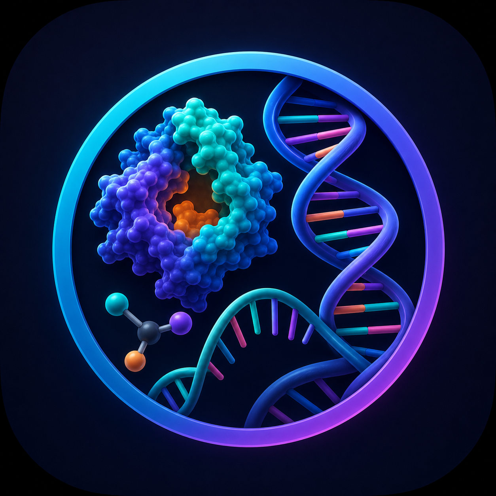
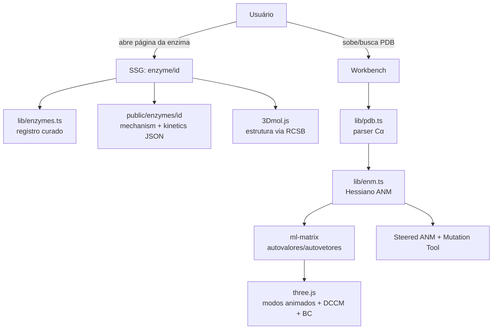
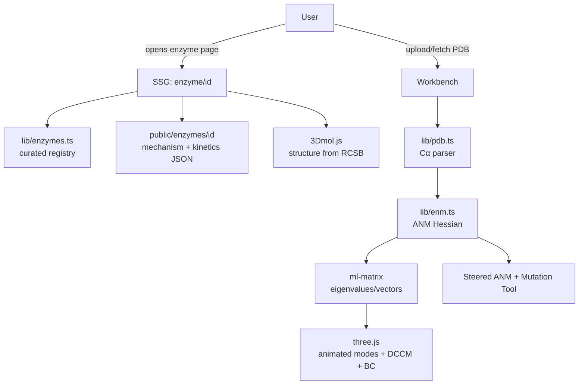

<div align="center">


# 🧬 Catalytic Atlas

### Explorador de Dinâmica Enzimática · *Enzyme Dynamics Explorer*

**Estrutura, mecanismo, cinética e dinâmica de enzimas — tudo no navegador, sem servidor.**
*Enzyme structure, catalytic mechanism, kinetics and dynamics — all in the browser, no backend.*


🇧🇷 [**Português**](#-português) · 🇺🇸 [**English**](#-english)

</div>

---

## 🇧🇷 Português
<a name="-português"></a>

### O que é

**Catalytic Atlas** é um explorador aberto, *browser-native*, de enzimas: estrutura 3D, resíduos catalíticos, mecanismo passo a passo, cinética e — o diferencial — **dinâmica de proteínas calculada no próprio navegador**. Sem conta, sem servidor, sem banco de dados. Cada URL é um *deep-link* reprodutível.

A premissa é didática e científica ao mesmo tempo: trazer para uma aba do navegador o tipo de exploração que normalmente exige cluster, *force field* e um especialista — usando o **Anisotropic Network Model (ANM)**, que captura os modos lentos e coletivos das proteínas de forma totalmente determinística e gratuita.

### Recursos

- **Catálogo curado** de 6 enzimas-paradigma, cada uma escolhida como caso clássico de ensino:
  - Lisozima (1AKI) · Triose-fosfato isomerase / TIM (1YPI) · α-Quimotripsina (4CHA) · Anidrase carbônica II (3KS3) · Protease do HIV-1 (1HVR) · Mpro do SARS-CoV-2 (6LU7).
- **Página por enzima** — visualizador 3D (3Dmol.js) destacando os resíduos catalíticos, *stepper* de mecanismo que conduz o destaque ao longo do ciclo catalítico, tabela de cinética, metadados e *links* para bases externas (RCSB, UniProt, M-CSA, BRENDA).
- **Simulador cinético** — explore Michaelis-Menten interativamente a partir dos parâmetros curados.
- **Workbench de dinâmica** — suba qualquer PDB (ou busque por ID) e rode um **ANM** no navegador:
  - modos lentos animados em 3D (renderização customizada em **three.js**);
  - matriz de correlação cruzada dinâmica (DCCM);
  - *betweenness centrality* como *proxy* de *hubs* alostéricos;
  - **ANM dirigido** (*steered*) e **ferramenta de mutação** para sondar respostas conformacionais.
- **100% client-side** — estruturas são *streamadas* do RCSB; a matemática roda no navegador via `ml-matrix`. Reprodutível, hospedável de graça (Vercel/Cloudflare Pages/Netlify), zero superfície de LGPD.

### Como rodar

```bash
npm install
npm run dev        # abre em http://localhost:3000
```

```bash
npm run build      # build de produção (estático onde possível)
npm run start      # serve o build
npm run typecheck  # checagem estrita de TypeScript, sem emitir
npm run lint       # ESLint (next lint)
```

**Adicionar uma nova enzima:**

```bash
npm run ingest -- 1RX2 --slug dhfr-1rx2
```

O script busca metadados no RCSB, a entrada no UniProt e pesquisa o M-CSA por número EC, gerando *templates* em `public/enzymes/<slug>/`. Depois, registre o ID em `lib/enzymes.ts` e preencha a curadoria (≈1–2 h por enzima lendo o M-CSA e a literatura primária).

### Estrutura

```
app/
  layout.tsx · page.tsx          # layout raiz + home/catálogo
  enzyme/[id]/page.tsx           # SSG por enzima (carrega JSON de /public)
  workbench/page.tsx             # workbench de ANM client-side
  about/page.tsx                 # escopo, fontes, limites
components/
  EnzymeDetailView · MechanismStepper · KineticsPanel · KineticSimulator
  ENMAnalysis · ModeViewer · SteeredANMPanel · MolViewer (3Dmol.js)
  viewer/                        # MolstarViewer, ThreeViewer, ThreeModeViewer,
                                 # MutationTool, ResidueInspector, ViewerControls
lib/
  enzymes.ts                     # registro curado das enzimas
  pdb.ts                         # parser PDB mínimo (apenas Cα)
  enm.ts                         # Hessiano ANM + autodecomposição + BC + steered
  types.ts · utils.ts
public/enzymes/<id>/             # meta.json + mechanism.json + kinetics.json
scripts/ingest.mjs               # scaffold de novas entradas (RCSB/UniProt/M-CSA)
```

### Arquitetura



> **Por que ANM e não MD?** MD entrega mais (solvatação, química reativa com QM/MM, dinâmica de milissegundos) mas exige cluster, *force field* e expertise. O ANM captura os movimentos lentos e coletivos de graça, é determinístico, tem um único parâmetro (o *cutoff* de contato, padrão 13 Å) e concorda surpreendentemente bem com B-factors experimentais. É a ferramenta certa para exploração interativa e didática. Para MD de produção: [OpenMM](https://openmm.org), [GROMACS](https://www.gromacs.org), [NAMD](https://www.ks.uiuc.edu/Research/namd/).

### Notas de método

- **Hessiano ANM** — Atilgan et al. 2001 ([doi](https://doi.org/10.1016/S0006-3495(01)76033-X)). Representação Cα, molas Hookeanas com *cutoff* radial.
- **Coletividade** — Brüschweiler 1995. **Correlação cruzada dinâmica** — Ichiye & Karplus 1991. **Betweenness centrality** — Brandes 2001 (Dijkstra em grafo de contatos ponderado por |correlação|⁻¹).

### Limites

ANM de conformação única (não descreve transições nem *unfolding*); sem solvente explícito (o *proton wire* da anidrase carbônica é anotado, não simulado); sem química reativa; limite prático ≈1200 resíduos (autodecomposição O(N³)).

### Licença

Código **MIT**. Dados curados em `public/enzymes/` sob **CC-BY 4.0** — atribua ao Catalytic Atlas e às fontes originais (RCSB, UniProt, M-CSA, SABIO-RK).

---

## 🇺🇸 English
<a name="-english"></a>

### What it is

**Catalytic Atlas** is an open, browser-native explorer of enzymes: 3D structure, catalytic residues, stepwise mechanism, kinetics and — the headline feature — **protein dynamics computed in the browser itself**. No account, no server, no database. Every URL is a reproducible deep-link.

The premise is both pedagogical and scientific: bring the kind of exploration that normally needs a cluster, a force field and an expert into a single browser tab — using the **Anisotropic Network Model (ANM)**, which captures the slow, collective motions of proteins deterministically and for free.

### Features

- **Curated catalog** of 6 paradigm enzymes, each a classic teaching case:
  - Lysozyme (1AKI) · Triosephosphate isomerase / TIM (1YPI) · α-Chymotrypsin (4CHA) · Carbonic anhydrase II (3KS3) · HIV-1 protease (1HVR) · SARS-CoV-2 Mpro (6LU7).
- **Per-enzyme page** — 3D viewer (3Dmol.js) highlighting catalytic residues, a mechanism stepper that drives the highlight through the catalytic cycle, a kinetics table, metadata and external-database links (RCSB, UniProt, M-CSA, BRENDA).
- **Kinetic simulator** — explore Michaelis-Menten interactively from the curated parameters.
- **Dynamics workbench** — upload any PDB (or fetch by ID) and run an **ANM** in your browser:
  - slow modes animated in 3D (custom **three.js** rendering);
  - dynamic cross-correlation matrix (DCCM);
  - betweenness centrality as a proxy for allosteric hubs;
  - **steered ANM** and a **mutation tool** to probe conformational responses.
- **100% client-side** — structures stream from the RCSB; the math runs in-browser via `ml-matrix`. Reproducible, free to host (Vercel/Cloudflare Pages/Netlify), zero data-privacy surface.

### How to run

```bash
npm install
npm run dev        # opens at http://localhost:3000
```

```bash
npm run build      # production build (static where possible)
npm run start      # serve the build
npm run typecheck  # strict TypeScript check, no emit
npm run lint       # ESLint (next lint)
```

**Add a new enzyme:**

```bash
npm run ingest -- 1RX2 --slug dhfr-1rx2
```

The script fetches metadata from RCSB, the UniProt entry and searches M-CSA by EC number, scaffolding templates in `public/enzymes/<slug>/`. Then register the ID in `lib/enzymes.ts` and fill in the curation (≈1–2 h per enzyme reading M-CSA and the primary literature).

### Structure

```
app/
  layout.tsx · page.tsx          # root layout + home/catalog
  enzyme/[id]/page.tsx           # per-enzyme SSG (loads JSON from /public)
  workbench/page.tsx             # client-side ANM workbench
  about/page.tsx                 # scope, sources, limits
components/                      # detail view, mechanism stepper, kinetics,
                                 # ENM analysis, mode viewer, steered ANM,
                                 # MolViewer (3Dmol.js) + viewer/* (three.js)
lib/
  enzymes.ts                     # curated enzyme registry
  pdb.ts                         # minimal PDB parser (Cα only)
  enm.ts                         # ANM Hessian + eigendecomposition + BC + steered
  types.ts · utils.ts
public/enzymes/<id>/             # meta.json + mechanism.json + kinetics.json
scripts/ingest.mjs               # scaffold new entries (RCSB/UniProt/M-CSA)
```

### Architecture



> **Why ANM and not MD?** MD gives more (solvation, reactive QM/MM chemistry, millisecond dynamics) but needs a cluster, a force field and expertise. The ANM captures slow collective motions for free, is deterministic, has a single parameter (the contact cutoff, default 13 Å) and agrees strikingly well with experimental B-factors. It is the right tool for interactive, teaching-oriented exploration. For production MD: [OpenMM](https://openmm.org), [GROMACS](https://www.gromacs.org), [NAMD](https://www.ks.uiuc.edu/Research/namd/).

### Method notes

- **ANM Hessian** — Atilgan et al. 2001. Cα representation, Hookean springs with radial cutoff.
- **Collectivity** — Brüschweiler 1995. **Dynamic cross-correlation** — Ichiye & Karplus 1991. **Betweenness centrality** — Brandes 2001 (Dijkstra on a contact graph weighted by |correlation|⁻¹).

### Limits

Single-conformation ANM (no transitions or unfolding); no explicit solvent (the carbonic-anhydrase proton wire is annotated, not simulated); no reactive chemistry; practical limit ≈1200 residues (O(N³) eigendecomposition).

### License

Code is **MIT**. Curated data in `public/enzymes/` is **CC-BY 4.0** — attribute to Catalytic Atlas and the upstream sources (RCSB, UniProt, M-CSA, SABIO-RK).

---

<div align="center">

*Parte do ecossistema de projetos de **Caio**.*

</div>
